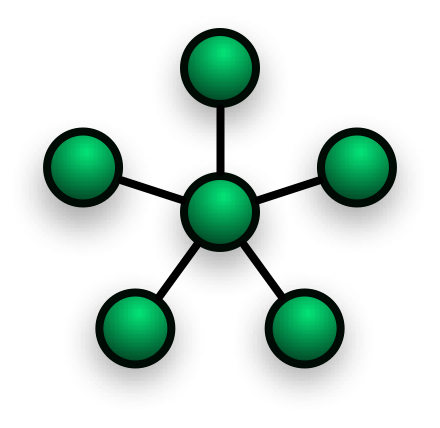

6.概念和架构
================================
CometD 工程实现了多种 Comet 技术 来提供可伸缩的web消息系统，它可以通过HTTP或者其他各种web协议，比如websocket

6.1 定义
----------------------
 客户端初始化连接，服务器接受连接，建立长连接，就是一直打开除非任意一方关闭它

 典型的客户端是浏览器，但是也可以是其他的应用，比如java应用，浏览器插件，或者其他脚本语言。

 根据使用的comet技术不同，一个客户端可能和服务器打开一个或者多个物理连接，但是可以认为在服务器和客户端之间只有一个逻辑的管道

 CometD 工程使用了 Bayeux 协议来交换服务器与客户端之间的信息，通信的单元是一个JSON格式的Bayeux 消息，一个消息包含了几个字段，一些是由Bayeux约定的，其他的可能是应用自己定义添加的。

 客户端和服务器交换的所有的消息都有一个 channel 字段， channel 提供了消息的分类， channel 是 CometD 的核心概念：发布者发送一个消息到 channel，channel的订阅者然后到了消息。

 6.1.1.Channel 定义
--------------------------------------
 一个 channnel 是一个看起来像 URL 的字符串,比如 /foo/bar ,/meta/connect ,/service/chat .

Bayeux 标准定义了三种 channel ：mata channels,service channels和broadcast channels。

以 /meta/ 开始的channel 是一个 meta channel，以 /service/ 开始的是 service channel ,其他的都是 broadcast channel.

channel字段是meta channel 的消息就是一个 meta 消息，service 消息和 broadcast 消息也一样。

应用可以任意创建 service channel 和 broadcast channel.

### 6.1.1.1.Meta Channels

Cometd 会创建 meta channels;应用不能创建新的 mata channels ，Meta channels 主要用来和应用交互 Bayeux 协议相关的一些信息，比如，握手有没有成功，或者连接被断开或者重连。

### 6.1.1.2 Service Channels

应用创建 service channels 用来满足服务器和客户端之间 request/response 风格的通信 （和 publish/subsribe 的风格相对应）。

### 6.1.1.3 Broadcast Channels

应用也可以创建 broadcase channels,它有消息主题的语义,被用于 publish/subsribe 风格的通讯,比如一个发送者想把消息广播给多个接收者

# 6.2 抽象定义

Cometd 实现了 web 消息系统，特别是 publish/subcribe 的场景.

