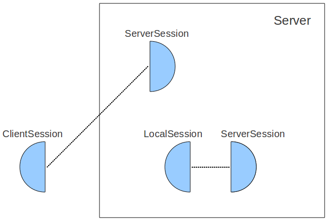
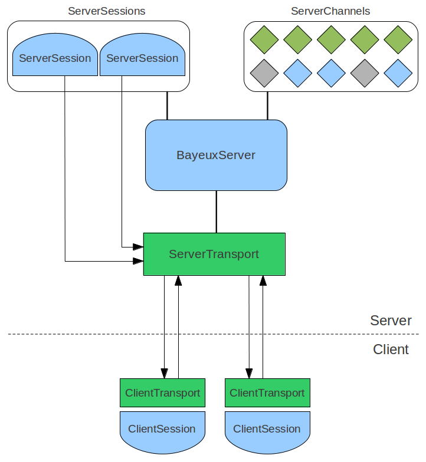

前言
================================
CometD是一个可伸缩的web事件路由总线，它允许您编写低延迟、服务器端、事件驱动的web应用程序。此类应用程序的典型示例是股票交易应用程序、web聊天应用程序、在线游戏和监控控制台。

CometD为您提供了实现这些消息模式的API:包括发布/订阅、点对点(通过服务器)和远程过程调用。这是通过使用一个独立的传输协议(Bayeux协议)实现的，它可以通过HTTP或WebSocket(或其他传输协议)进行传输，这样您的应用程序就不会绑定到特定的传输技术。

CometD可以利用WebSocket(因为它是最高效的web消息传递协议)，而在使用HTTP时使用了被称为Comet的Ajax推送技术模式。

CometD项目提供了Java和JavaScript库，允许您以简单和可移植的方式编写低延迟、服务器端、事件驱动的web应用程序。因此，您可以将精力集中在应用程序的业务方面，而不必担心诸如传输(HTTP或WebSocket)、可伸缩性和健壮性等底层细节。CometD库已经提供了这些的特性。

3.安装
================================
### 3.1.要求与依赖
为了运行CometD应用程序，您需要Java开发工具包(JDK)-version 7.0或更高版本，以及一个兼容的Servlet 3.0或更高的Servlet容器，如Jetty。

CometD的实现依赖于很少的Jetty库，比如Jetty-util-ajax-<version>.jar及其他。这些Jetty依赖通常被打包在应用程序的WEB-INF/lib目录中的.war文件中，不需要部署应用程序。Jetty中的war文件:基于cometd的应用程序将在任何其他兼容的Servlet 3.0或更高的Servlet容器中以同样的方式工作。

当前的Jetty版本CometD依赖默认为:

	<jetty-version>9.2.22.v20170606</jetty-version>
	<!--<jetty-version>9.3.21.v20170918</jetty-version>-->
	<!--<jetty-version>9.4.7.v20170914</jetty-version>-->

从Jetty 9.2.x开始，可以使用不同的Jetty版本来运行CometD 。您可以找到如何使用不同的Jetty版本构建CometD的示例，如何使用不同的Jetty版本运行CometD演示，以及如何使用不同的Jetty版本创建web应用程序。

### 3.2.下载与安装
你可以从[http://download.cometd.org/](http://download.cometd.org/)下载CometD。

然后在您选择的目录中解压CometD:

	$ tar zxvf cometd-<version>-distribution.tgz
	$ cd cometd-<version>/

### 3.3.运行DEMOS
CometD Demos包括：

- 三个完整的聊天应用程序(一个是与Dojo一起开发的，一个是jQuery的，一个是Angular1)；
- 包括：消息确认、重载、timesync和时间戳等的示例；
- 一个如何向特定用户发送私有消息的示例；
- 集群拍卖演示(使用Oort集群)。

##### 3.3.1.使用MAVEN运行DEMOS
如果你想看看CometD演示/或者想尝试您的应用程序，建议以这种模式的运行CometD演示,但它不是推荐的方式来部署一个CometD在生产中的应用。请参阅下一节，了解如何在生产中部署CometD应用程序。

Maven要求您设置JAVA_HOME环境变量以指向您的JDK安装。

在此之后，运行CometD演示非常简单。假设$COMETD是COMETD安装目录，并且在您的PATH中有mvn可执行文件:

	$ cd $COMETD
	$ cd cometd-demo
	$ mvn jetty:run

最后用命令启动嵌入式Jetty来监听8080端口。现在将浏览器指向http://localhost:8080，查看CometD演示主页。

如果您想用不同的Jetty版本运行CometD演示，请将最后一个命令更改为:

	$ mvn jetty:run -Djetty-version=<alternate-jetty-version>

例如：

	$ mvn jetty:run -Djetty-version=9.3.10.v20160621

----------
 - 注意：使用Jetty9.2.x运行CometD要求JDK7版本，使用Jetty9.3.x或更高版本要求至少JDK8.

### 3.4.部署CometD应用程序
当您开发CometD应用程序时，您将开发一个标准的Java EE Web应用程序，然后将其打包成一个war文件。您可以遵循入门部分或CometD教程，以了解如何构建和打包CometD应用程序。

一旦您将CometD应用程序打包为一个war文件，您可以将其部署到任何支持Servlet 3.0或更高版本的Servlet容器中。

请参阅本节以获取进一步的信息，以及有关在Servlet 3.0(或更大)容器上部署的具体说明。

##### 3.4.1.在独立的Jetty中部署CometD应用程序
下面的说明描述了运行CometD应用程序所需的非常小的Jetty设置。有关配置Jetty的详细信息，请参阅官方Jetty文档。

按照以下步骤将CometD应用程序部署到Jetty中。这些指令对于Unix/Linux操作系统是有效的，但是可以很容易地翻译为Windows操作系统。

从Eclipse Jetty下载Jetty发行版。

然后在您选择的目录中解压Jetty发行包，例如/tmp:

	$ cd /tmp
	$ tar zxvf jetty-distribution-<version>.tar.gz
这就创建了一个的名为/tmp/jetty-distribution -<版本>/的目录，它被作为JETTY_HOME。

创建您选择的另一个目录，例如在您的主目录中:

	$ cd ~
	$ mkdir jetty_cometd

这将创建一个名为~/jetty_cometd的目录，该目录作为JETTY_BASE。

由于Jetty是一个高度模块化的Servlet容器，JETTY_BASE配置为您的Jetty目录，其中包含运行CometD应用程序所需的Jetty模块。

为了运行CometD应用程序，Jetty需要配置一些模块:

- http模块，为http协议提供支持。
- websocket模块，为websocket协议提供支持。
- 部署模块，为部署.war文件提供支持 

因此：

	$ cd $JETTY_BASE
	$ java -jar $JETTY_HOME/start.jar --add-to-start=http,websocket,deploy

现在Jetty被配置为运行CometD应用程序，而您只需要部署您的.war文件到Jetty(如果您还没有构建您的应用程序可以使用CometD演示.war文件)：

	$ cp /path/to/cometd_application.war $JETTY_BASE/webapps/

现在可以启动Jetty:

	$ cd $JETTY_BASE
	$ java -jar $JETTY_HOME/start.jar

最后用一个命令启动Jetty，它部署您的.war文件，并激活您的CometD应用程序。

##### 3.4.2.使用嵌入式Jetty部署CometD应用程序
您还可以通过编程方式部署CometD应用程序，使用Jetty api将您的web应用程序嵌入到您将从命令行开始的普通Java应用程序中。

下面你可以找到一个{github}/cometd-demo/src/test/java/org/cometd/demo/Demo.java[示例]展示了如何建立支持HTTP、HTTPS和WebSocket传输的嵌入式Jetty和CometD:

	// Setup and configure the thread pool.
	QueuedThreadPool threadPool = new QueuedThreadPool();
	
	// The Jetty Server instance.
	Server server = new Server(threadPool);
	
	// Setup and configure a connector for clear-text http:// and ws://.
	HttpConfiguration httpConfig = new HttpConfiguration();
	ServerConnector connector = new ServerConnector(server, new HttpConnectionFactory(httpConfig));
	connector.setPort(HTTP_PORT);
	server.addConnector(connector);
	
	// Setup and configure a connector for https:// and wss://.
	SslContextFactory sslContextFactory = new SslContextFactory();
	sslContextFactory.setKeyStorePath("src/test/resources/keystore.jks");
	sslContextFactory.setKeyStorePassword("storepwd");
	sslContextFactory.setKeyManagerPassword("keypwd");
	HttpConfiguration httpsConfig = new HttpConfiguration(httpConfig);
	httpsConfig.addCustomizer(new SecureRequestCustomizer());
	ServerConnector tlsConnector = new ServerConnector(server, sslContextFactory, new HttpConnectionFactory(httpsConfig));
	tlsConnector.setPort(8443);
	server.addConnector(tlsConnector);
	
	// The context where the application is deployed.
	ServletContextHandler context = new ServletContextHandler(server, CONTEXT_PATH);
	
	// Configure WebSocket for the context.
	WebSocketServerContainerInitializer.configureContext(context);
	
	// Setup JMX.
	MBeanContainer mbeanContainer = new MBeanContainer(ManagementFactory.getPlatformMBeanServer());
	server.addBean(mbeanContainer);
	context.setInitParameter(ServletContextHandler.MANAGED_ATTRIBUTES, BayeuxServer.ATTRIBUTE);
	
	// Setup the default servlet to serve static files.
	context.addServlet(DefaultServlet.class, "/");
	
	// Setup the CometD servlet.
	String cometdURLMapping = "/cometd/*";
	ServletHolder cometdServletHolder = new ServletHolder(CometDServlet.class);
	context.addServlet(cometdServletHolder, cometdURLMapping);
	// Required parameter for WebSocket transport configuration.
	cometdServletHolder.setInitParameter("ws.cometdURLMapping", cometdURLMapping);
	// Optional parameter for BayeuxServer configuration.
	cometdServletHolder.setInitParameter("timeout", String.valueOf(15000));
	// Start the CometD servlet eagerly to show up in JMX.
	cometdServletHolder.setInitOrder(1);
	
	// Add your own listeners/filters/servlets here.
	
	server.start();

> 如果您的应用程序需要使用WebSocket客户端连接其他服务，您可能会在启动时获得NoSuchMethodError错误。

> 如果是这样的话，那是因为事实上(Maven格式<groupId>:<artifactId>) org. java:cometd-java-websocket-jetty-client组件依赖于Jetty的混合分类器org.eclipse.jetty.websocket:websocket-client。

> 该组件的混合版本用于部署使用war文件的web应用程序，是用于典型的部署CometD web应用程序。

> 在嵌入式模式中，您不能使用该组件的混合版本，而是应使用常规版本。这通常是通过显式地排除混合版本和显式地包含组件的常规版本来完成的。

> 例如，使用Maven:

	<dependencies>
    ...
    <!-- Explicitly exclude the hybrid dependency. -->
    <dependency>
        <groupId>org.cometd.java</groupId>
        <artifactId>cometd-java-websocket-jetty-client</artifactId>
        <version>${cometd.version}</version>
        <exclusions>
            <exclusion>
                <groupId>org.eclipse.jetty.websocket</groupId>
                <artifactId>websocket-client</artifactId>
            </exclusion>
        </exclusions>
    </dependency>
    <!-- Explicitly include the regular dependency. -->
    <dependency>
        <groupId>org.eclipse.jetty.websocket</groupId>
        <artifactId>websocket-client</artifactId>
        <version>${jetty.version}</version>
    </dependency>
    ...
	</dependencies>

##### 3.4.3.使用另一个Servlet容器运行演示
将CometD应用程序部署到不同的Servlet容器中需要做的是与上面描述的Jetty类似的步骤。

对于您选择的Servlet容器，请参考具体的Servlet容器配置手册，来了解如何部署CometD应用程序.war文件。

4.故障诊断
================================
### 4.1.日志
当CometD不起作用时，您要做的第一件事是启用调试日志记录。这是有帮助的，因为通过阅读调试日志，您可以更好地了解系统中正在发生的事情(并且仅这一点就可以为您提供解决问题所需的答案)，并且CometD开发人员可能需要调试日志来帮助您。

##### 4.1.1.启用JavaScript库中的调试日志
要在JavaScript客户端库中启用调试日志(请参阅JavaScript库部分)，您必须在cometd的配置对象中配置logLevel字段为“debug”值(请参阅JavaScript库配置部分的其他配置选项)：

		cometd.configure({
		    url: 'http://localhost:8080/cometd',
		    logLevel: 'debug'
		});

CometD JavaScript库使用window控制台对象输出日志语句。

一旦您在JavaScript客户端库中启用了日志记录，您就可以在浏览器JavaScript控制台中看到调试日志。例如,在Firefox中您可以通过点击工具→Web开发人员→Web控制台来打开JavaScript控制台,在Chrome可以通过点击工具→开发工具打开JavaScript控制台。

> 注意：Internet Explorer没有和其他浏览器一样定义window控制台对象，导致CometD不能在JavaScript控制台上输出日志，这取决于Internet Explorer版本。

##### 4.1.2.在Java服务器库中启用调试日志记录
CometD Java库(客户机和服务器)都使用SLF4J作为日志框架。Java服务器库使用SLF4J api，但是它不绑定到任何特定的日志实现。您必须选择要使用的实现。默认情况下，SLF4J附带了一个简单的绑定，它不记录在调试级别生成的语句。

因此，您必须使用更高级的绑定(如Log4J或Logback)配置SLF4J。了解如何使用高级绑配置日志请参考SLF4J文档和绑定实现文档。

因此，为您的应用程序启用CometD调试日志，您需要配置您选择使用的任何SLF4J绑定。

一个简单的例子是，对于Log4J，通常可以在WEB-INF/lib中添加SLF4J-Log4J绑定jar 包(slf4j-log4j12-<slf4j-version>.jar)和Log4J jar (Log4J-<Log4J-version>.jar)，然后在web-inf/classes目录下添加一个适当的log4j.properties属性配置文件。您当然不希望手动添加这些文件;这里只是作为一个简单的参考。通常，这些依赖关系配置在您用来创建web应用程序的构建系统中。

一旦您在Java服务器库中启用了日志记录，您就可以在启动了Servlet容器的终端中(或者在其日志文件中，这取决于它的配置方式)看到调试日志。

5.引导
================================
5.1.准备
---------------------
使用CometD API进行项目开发时需要做一些准备，特别是在工具方面，这样可以节省大量的时间。一个重要的工具是Firebug(如果您正在使用Firefox进行开发)，或者Internet Explorer的工具，称为Developer Tools。

CometD项目是使用Maven构建的，使用Maven来构建您的应用程序是一种很合适的方式。这个引子使用Maven作为设置、构建和运行应用程序的基础，但是其他构建工具也可以应用相同的概念。

>注意：windows 用户
>
>如果您在Windows操作系统中工作，请避免使用包含空格的路径，例如“C:\Document And Settings\”，作为您的基本路径。使用“C:\CometD\”这样的基本路径。

5.2.设置项目
---------------------
您可以以两种方式设置项目:使用Maven的方式或非Maven的方式。对于这两种方法，您可以按照设置章节来查看项目的一些文件是如何设置的。

### 5.2.1. Maven 方式

从一个不包含pom.xml的目录中执行以下命令(否则您将得到一个Maven错误)，例如一个空目录：

	$ cd /tmp
	$ mvn org.apache.maven.plugins:maven-archetype-plugin:2.4:generate -DarchetypeCatalog=http://cometd.org
	...
	Choose archetype:
	1: local -> org.cometd.archetypes:cometd-archetype-dojo-jetty9
	2: local -> org.cometd.archetypes:cometd-archetype-spring-dojo-jetty9
	3: local -> org.cometd.archetypes:cometd-archetype-jquery-jetty9
	4: local -> org.cometd.archetypes:cometd-archetype-spring-jquery-jetty9
	Choose a number:

正如您所看到的，有四个archetypes，可以使用Dojo或jQuery JavaScript工具包构建一个框架应用程序，两者都可以选择使用Jetty 9或者和Spring。选择Jetty 9的Dojo，即archetypes number 1。archetypes的生成要求您定义多个属性并为您生成应用程序框架，例如:

	Choose a number: : 1
	Define value for property 'groupId': : org.cometd.primer
	Define value for property 'artifactId': : dojo-jetty9-primer
	Define value for property 'version':  1.0-SNAPSHOT: :
	Define value for property 'package':  org.cometd.primer: :
	[INFO] Using property: cometdVersion = 3.0.0
	[INFO] Using property: jettyVersion = 9.2.0.v20140526
	[INFO] Using property: slf4jVersion = 1.7.7
	Confirm properties configuration:
	groupId: org.cometd.primer
	artifactId: dojo-jetty9-primer
	version: 1.0-SNAPSHOT
	package: org.cometd.primer
	cometdVersion: 3.0.0
	jettyVersion: 9.2.0.v20140526
	slf4jVersion: 1.7.7
	Y: :
	...
	[INFO] BUILD SUCCESS

>注意：现在不要担心用于生成应用程序框架的Jetty版本，因为之后可以很容易地更改它。

然后：

	$ cd dojo-jetty9-primer/

骨架工程存在以下一样的结构：

	$ tree .
	.
	|-- pom.xml
	`-- src
	    `-- main
	        |-- java
	        |   `-- org
	        |       `-- cometd
	        |           `-- primer
	        |               |-- CometDInitializer.java
	        |               `-- HelloService.java
	        `-- webapp
	            |-- application.js
	            |-- index.jsp
	            `-- WEB-INF
	                `-- web.xml

框架项目已经准备好让您使用下面的命令运行:
	
	$ mvn clean install
	$ mvn jetty:run

现在你的浏览器指向http://localhost:8080/dojo-jetty9-primer,您应该看到这个消息:

	CometD Connection Succeeded
	Server Says: Hello, World

就是这样。您已经编写了第一个CometD应用程序:-)

如果您想使用与CometD的默认Jetty版本不同的Jetty版本，可以通过打开主pom.xml文件并修改jetty版本元素的值来轻松实现，例如:

	<project ... >
	
	    ....
	
	    <properties>
	        ...
	        <jetty-version>9.2.17.v20160517</jetty-version>
	        ....
	    </properties>
	
	    ...
	
	</project>

然后您只需如上所述重新构建并重新运行项目。

### 5.2.2.非Maven 方式

第一步是在提供服务的web容器的示例Dojo中配置您喜欢的JavaScript工具包。在使用Maven的方式时，会通过绑定到CometD-javascript-Dojo-<version>.war文件覆盖CometD Dojo来自动获得，但是这里必须手动配置(位于CometD分发版的 CometD-javascript/dojo/target目录中的cometd-javascript-dojo-<version>.war)。

1. 从http://dojotoolkit.org下载Dojo；
2. 解压dojo-release-<version>.tar.gz文件到一个目录，例如/tmp，因此您有一个目录/tmp/dojo-release-<version>，命名为$DOJO；
3. 删除Dojo提供的$DOJO/dojox/cometd.js和$DOJO/dojox/cometd.js.uncompressed.js文件(这些文件都是空的，只是一些您将在稍后放置的文件存根)；
4. 删除Dojo提供的$DOJO/dojox/cometd目录；
5. 复制cometd-javascript-dojo-<version>.war中的dojox/cometd.js文件到$DOJO/；
6. 复制cometd-javascript-dojo-<version>.war中的dojox/cometd目录到$DOJO/。$DOJO/dojox/cometd目录中的内容应该为如下：

		dojox/cometd
		|-- ack.js
		|-- main.js
		|-- reload.js
		|-- timestamp.js
		`-- timesync.js

7. 在$DOJO/中位于dojox目录的同一级别下，从cometd-javascript-dojo-<version>.war中添加org目录及期所有内容；

	最终的内容，相当于Maven的方式，应该是这样的:

		.
		|-- dijit
		|-- dojo
		|-- dojox
		|   |-- cometd
		|   |   |-- ack.js
		|   |   |-- main.js
		|   |   |-- reload.js
		|   |   |-- timestamp.js
		|   |   `-- timesync.js
		|   `-- cometd.js
		|-- org
		|   |-- cometd
		|   |   |-- AckExtension.js
		|   |   |-- ReloadExtension.js
		|   |   |-- TimeStampExtension.js
		|   |   `-- TimeSyncExtension.js
		|   `-- cometd.js
		|-- WEB-INF
		|   |-- classes
		|   |   `-- org
		|   |       `-- cometd
		|   |           `-- primer
		|   |               |-- CometDInitializer.class
		|   |               `-- HelloService.class
		|   |-- lib
		|   |   |-- bayeux-api-<version>.jar
		|   |   |-- cometd-java-common-<version>.jar
		|   |   |-- cometd-java-server-<version>.jar
		|   |   |-- cometd-java-websocket-common-server-<version>.jar
		|   |   |-- cometd-java-websocket-javax-server-<version>.jar
		|   |   |-- jetty-continuation-<version>.jar
		|   |   |-- jetty-http-<version>.jar
		|   |   |-- jetty-io-<version>.jar
		|   |   |-- jetty-jmx-<version>.jar
		|   |   |-- jetty-servlets-<version>.jar
		|   |   |-- jetty-util-<version>.jar
		|   |   |-- jetty-util-ajax-<version>.jar
		|   |   |-- slf4j-api-<version>.jar
		|   |   `-- slf4j-simple-<version>.jar
		|   `-- web.xml
		|-- application.js
		`-- index.jsp

org目录包含CometD实现和扩展，而dojox目录中的对应文件是Dojo绑定。jQuery工具包中存在其他绑定，但是CometD实现是相同的。

第二步是配置服务器端。如果您使用Java，这意味着您必须设置CometD servlet来响应来自客户端的消息。服务器端配置和服务开发的详细信息将在Java服务库部分中解释。

最后一步是编写一个JSP(或HTML)文件，下载JavaScript依赖项和JavaScript应用程序，如下部分所述。

### 5.2.3.设置细节
`index.jsp` JSP文件，包含对JavaScript工具包依赖项和JavaScript应用程序文件的引用:

	<!DOCTYPE html>
	<html>
	  <head>
	    
	    
	  </head>
	<body>
	  ...
	</body>
	</html>

它还配置了JavaScript配置对象:`config`，是JavaScript应用程序可能需要的变量。但这是完全可选的。

JavaScript应用程序中包含的`application.js`文件，配置`cometd`对象并启动应用程序。该archetypes 提供:

	require(['dojo/dom', 'dojo/_base/unload', 'dojox/cometd', 'dojo/domReady!'],
	    function(dom, unloader, cometd) {
	        function _connectionEstablished() {
	            dom.byId('body').innerHTML += '
CometD Connection Established
';
	        }
	
	        function _connectionBroken() {
	            dom.byId('body').innerHTML += '
CometD Connection Broken
';
	        }
	
	        function _connectionClosed() {
	            dom.byId('body').innerHTML += '
CometD Connection Closed
';
	        }
	
	        // Function that manages the connection status with the Bayeux server
	        var _connected = false;
	
	        function _metaConnect(message) {
	            if (cometd.isDisconnected()) {
	                _connected = false;
	                _connectionClosed();
	                return;
	            }
	
	            var wasConnected = _connected;
	            _connected = message.successful === true;
	            if (!wasConnected && _connected) {
	                _connectionEstablished();
	            } else if (wasConnected && !_connected) {
	                _connectionBroken();
	            }
	        }
	
	        // Function invoked when first contacting the server and
	        // when the server has lost the state of this client
	        function _metaHandshake(handshake) {
	            if (handshake.successful === true) {
	                cometd.batch(function() {
	                    cometd.subscribe('/hello', function(message) {
	                        dom.byId('body').innerHTML += '
Server Says: ' + message.data.greeting + '
';
	                    });
	                    // Publish on a service channel since the message is for the server only
	                    cometd.publish('/service/hello', {name: 'World'});
	                });
	            }
	        }
	
	        // Disconnect when the page unloads
	        unloader.addOnUnload(function() {
	            cometd.disconnect(true);
	        });
	
	        var cometURL = location.protocol + "//" + location.host + config.contextPath + "/cometd";
	        cometd.configure({
	            url: cometURL,
	            logLevel: 'debug'
	        });
	
	        cometd.addListener('/meta/handshake', _metaHandshake);
	        cometd.addListener('/meta/connect', _metaConnect);
	
	        cometd.handshake();
	    });

请注意以下几点:

- 使用`dojo/domReady!`依赖来等待文档在执行`cometd`对象初始化之前的加载。
- 当页面刷新或关闭时，使用`dojo.addOnUnload()`来断开连接。
- 使用函数`_metaHandshake()`来设置与服务器第一次连接时的初始配置(或当服务器丢失客户端信息时，例如由于服务器重启)。这是完全可选的，但强烈推荐，这是推荐的执行订阅的方法。
- 使用函数`_metaConnect()`来检测通信何时成功建立(或重新建立)。这是完全可选的，但强烈推荐。

	请注意，使用`_metaConnect()`和`_connected` 状态变量可以导致您的代码(在这个简单的示例中设置innerHTML属性)被调用不止一次，例如，如果您经历了临时网络故障或服务器重新启动。

	因此，您放入`_connectionEstablished()`函数的代码必须是幂等的。换句话说，确保如果`_connectionEstablished()`函数被调用不止一次，那么它的行为就像只调用一次一样。

6.概念和架构
================================
CometD项目实现了多种Comet技术，以提供可伸缩的web消息系统，该系统可以通过HTTP或其他新兴web协议(如WebSocket)运行。

6.1 定义
----------------------
 客户端初始化连接，服务器接受连接，建立长连接，就是一直打开除非任意一方关闭它

 典型的客户端是浏览器，但是也可以是其他的应用，比如java应用，浏览器插件，或者其他脚本语言。

 根据使用的comet技术不同，一个客户端可能和服务器打开一个或者多个物理连接，但是可以认为在服务器和客户端之间只有一个逻辑的管道

 CometD 工程使用了 Bayeux 协议来交换服务器与客户端之间的信息，通信的单元是一个JSON格式的Bayeux 消息，一个消息包含了几个字段，一些是由Bayeux约定的，其他的可能是应用自己定义添加的。字段是键值对,如消息有foo字段，意味着消息有一个字段，其键是字符串foo。

 客户端和服务器交换的所有的消息都有一个 channel 字段， channel 提供了消息的分类， channel 是 CometD 的核心概念：发布者发送一个消息到 channel，channel的订阅者然后接收到了消息。

 6.1.1.Channel 定义
--------------------------------------
 一个 channnel 是一个看起来像 URL 的字符串,比如 /foo/bar ,/meta/connect ,/service/chat .

Bayeux 标准定义了三种 channel ：mata channels,service channels和broadcast channels。

以 /meta/ 开始的channel 是一个 meta channel，以 /service/ 开始的是 service channel ,其他的都是 broadcast channel.

channel字段是meta channel 的消息就是一个 meta 消息，service 消息和 broadcast 消息也一样。

应用可以任意创建 service channel 和 broadcast channel.

### 6.1.1.1.Meta Channels

Cometd 会创建 meta channels;应用不能创建新的 mata channels ，Meta channels 主要用来和应用交互 Bayeux 协议相关的一些信息，比如，握手有没有成功，或者连接被断开或者重连。

### 6.1.1.2 Service Channels

应用创建 service channels 用来满足服务器和客户端之间 request/response 风格的通信 （和broadcast Channels的 publish/subsribe 的风格相对应）。

### 6.1.1.3 Broadcast Channels

应用也可以创建 broadcase channels,它有消息主题的语义,被用于 publish/subsribe 风格的通讯,比如一个发送者想把消息广播给多个接收者

### 6.1.1.4.Channels中使用通配符

你可以使用通配符匹配多个channels：channel `/foo/*`匹配`/foo/bar`，但不匹配`/foo/bar/baz`，后台使用`/foo/**`来匹配，你可以为任意类型的channel使用通配符：`/meta/*`匹配所有meta channels，`/service/**`匹配所有`/service/bar`，及`/service/bar/baz`。`/**`匹配任何channel。

您仅可以将通配符指定为channel的最后一部分，因此这些是无效的channels:/**/foo或/foo/*/bar。

### 6.1.1.5.通道中使用参数

你可以在channels中使用部分参数：`/foo/{id}`。含有部分参数的Channels称为*template channels*，因为它定义了一个可以匹配到真实channel的模板，来将实际值绑定到模板channel的参数上。模板channel用于在annotated服务，在annotated listeners和annotated subscribers查看他们的用法。例如，`/news/{category}`应用于`/news/sport`channel时，那么`category`会绑定"sport"字符串。

模板channels仅用于channel中段数量一致的情况。例如，`/news/{category}`不会应用在`/news`（段太少），也不会应用在`/news/sport/athletics`（段太多），亦不会应用于`/other/channel`（非参数部分不匹配），而可以在`/news/football`上为`category` 绑定"football"字符串。

一个模板channel不能同时是一个通配符channel，因此`/foo/{id}/*` 或者 `/foo/{var}/**`channel是无效的。

# 6.2 高级抽象

Cometd 实现了 web 消息系统，特别是 publish/subcribe 的场景.

在 publish/subcribe 消息系统里面，发布者发送分好类的消息，订阅者订阅一种或者多种消息，这样他们仅仅接受他们订阅的感兴趣消息，消息的发送者，是不知道他们发送的消息有多少人接收的。

CometD是一个 hub-spoke 拓扑，在默认的配置里，就意味这有一个中心服务器，所有的客户端都连接上面

在 CometD 里面，服务器接受发布者的消息，如果消息的channel 是 broadcast 的话，则将消息转发给感兴趣的订阅者。CometD以一种特殊的方式处理meta messages和service messages；它不会将它们重新路由到任何订阅者（默认情况下，禁止订阅元通道，而订阅服务通道是不允许操作的）。

例如，假设`clientAB`订阅了channels `/A`和`/B`，而`clientB`订阅了channel `/B`。如果发布者在channel`/a`上发布消息，则只有`clientAB`接收它。换句话说，如果发布者在channel`/B`上发布消息，则`clientAB`和`clientB`都可接收到消息。此外，如果发布者在channel`/C`上发布消息，那么`clientAB`和`clientB`都不会接收到消息，然后结束它在服务器上的旅程。重新路由broadcast messages是服务器的默认行为，它不需要任何应用程序代码来执行重新路由。

抽象来看，您可以看到消息是通过conduits（管道）在客户端和服务器之间来回流动。单个broadcast messages可能到达服务器并重新路由到所有客户端;您可以想象当它到达服务器时，消息被复制，并将副本发送给每个客户端(尽管出于效率的原因，这并不是实际发生的情况)。如果发送者也订阅它发布消息的channel，它也将收到消息的副本。

# 6.3. 具体定义

接下来的章节将更进一步的研究CometD是如何工作的。

现在我们清楚地知道CometD的核心是一个通过Bayeux协议进行交互的client/server 系统。

在CometD的实现中，使用half-object plus protocol模式捕获取client/server的通信：当客户端half-object对象建立了一个与服务端的通信管道后，相应的服务端的half-object也被创建，它们两个就可以进行通信了。CometD使用了这种模式的变种，因为需要对传输消息进行传输的抽象。这种传输是基于Http协议的，当然在最近的CometD版本中也可以基于WebSocket协议（你也可以插入更多的协议）。

广义上讲，*client*是由client half-object和client transport组成的，而*server*则是更复杂的实体组合，包括server half-objects和server transports。

6.3.1 会话Sessions
------------------

会话在CometD中是一个核心概念。它们是通信协议中所涉及的half-objects的表现。

有三种会话：

- *Clinet sessions*客户端会话－是客户端的client half-object。 客户端会话在JavaScript中是由`org.cometd.CometD`对象表示的，在JAVA中是由`org.cometd.bayeux.client.ClientSession`类表示（其实更多的是由它的子类`org.cometd.bayeux.client.BayeuxClient`表示）。客户端创建一个client session来与服务端建立起Bayeux通信，这样客户端就可以发布和接收消息了。
- *Server sessions*服务端会话－是服务端的server half-object。服务端会话在服务端是由`org.cometd.bayeux.server.ServerSession`类表示的；它们与客户端会话是一一匹配的。当一个客户端创建了一个client session后，它最初不会关联一个对应的server session。仅当client session与服务端建立了Bayeux通信后，服务端才创建它相应的server session，以及两个half-objects的连接。每个server session有一个消息队列（message queue）。消息被发布到一个channel后，必须要投递到订阅了该channel的远程client sessions。消息首先进入server session的消息队列，然后投递到相应的client session。
- *Local sessions*本地会话－是处于服务端的client half-object，由`org.cometd.bayeux.server.LocalSession`类表示。本地会话可以被认为是生存于服务端的客户。他们不代表远程客户端，而是一个server-side client（服务端客户）。本地会话可以订阅channel，并像client session一样发布消息。服务端只认识服务端会话，而创建服务端会话唯一的方式是首先要创建相应的客户端会话，然后与服务端建立起Bayeux通信。出于这个原因，在服务端便有了额外的本地会话的概念。local session是生存于服务端的client session，因此它是服务端本地会话。例如，假设一个远程客户端每当状态有变化时发送一条消息。其它远程客户端订阅了该channel，并接收那些状态更新消息。但是，如果在接收到远程客户端状态更新后，你想要在服务端执行一些动作怎么办呢？那么你需要一个存在于服务端的等价的远程客户端，这就是local session。

服务端的各服务通过一个local session来关联。在创建服务端的服务时，local session 与之握手并创建相应的server sesion half-object，因而服务端对同样的方式对待客户端会话与本地会话。服务端将消息发送给所有订阅了该channel的服务端会话，无论他们是来自远程客户端会话还是本地会话。

有关更多的服务信息，请查看服务章节

6.3.2. Server服务
-----------------
*server*使用`org.cometd.bayeux.server.BayeuxServer`来表示。BayeuxServer对象作用包括：

- server sessions的Repository，参见会话章节
- server transports的Repository－用`org.cometd.bayeux.server.ServerTransport`类来表示。server transport是一个服务端的组件，用于处理与客户端通信的细节。包话HTTP server transports，WebSocket server transport，你也可以添加其他类型的。Server transports抽象了通信细节，应用只要知道Bayeux消息即可，而无需关心他们是如何到达服务端的。
- server channels的Repository－ 使用`org.cometd.bayeux.server.ServerChannel`类表示。server channel是channel在服务端的表示；它可以接收和发布Bayeux消息。
- *extensions*的Repository－使用`org.cometd.bayeux.server.BayeuxServer.Extension`类表示。Extensions扩展允许应用程序使用Bayeux协议进行交互，如修改，删除或重载Bayeux消息。extensions的更多信息请参阅extensions章节。
- 授权认证中心，通过一个安全策略实例－`org.cometd.bayeux.server.SecurityPolicy`类来表示。CometD询问安全策略以授权任何服务端的敏感操作。例如握手，创建channel，订阅channel，发布channel。应用程序可以提供他们自己的安全策略，以实现它们自己的授权逻辑。有关安策略更多的信息，请参阅authorization授权章节。
- 授权者－使用`org.cometd.bayeux.server.SecurityPolicy`类表示，允许你应用更细粒度的授权策略。进一步的授权者信息，参阅authorizers章节。
- 消息处理器，用于协调服务端传输、扩展、安全策略的工作，以及实现消息流算法(参见消息处理部分)，允许应用程序与消息和通道交互以实现其应用程序逻辑。

6.3.3. Listeners监听器
---------------------
应用程序使用监听器与session、channel、及server进行交互。在Java与JavaScript的API中，允许应用程序注册各种监听器来接收相应事件的通知。您可以将扩展、安全策略和授权程序看作特殊类型的监听器。以后的章节我们也将这样看待。

### 6.3.3.1. Client Sessions and Listeners

客户端会话监听器的作用包括：

- 通过`ClientSession.addExtension(ClientSession.Extension)`接口你可以为client session添加extension，用于session发送和到达的出入消息进行交互。
- 一个client session就是一个channel的repository；你可以通过`ClientSession.getChannel(String).addListener(ClientSessionChannel.MessageListener)`接口给一个channel添加消息监听器，以当消息到达特定的channel时来通知你。

### 6.3.3.2. Servers and Listeners

在服务端，模式类似，但更丰富。

- 你可以通过`BayeuxServer.addExtension(BayeuxServer.Extension)`接口为所有流经服务端的消息的`BayeuxServer`实例添加extension。
- `BayeuxServer`允许你通过`BayeuxServer.addListener(BayeuxServer.ChannelListener)`接口添加接收创建或销毁channel通知的监听器，通过`BayeuxServer.addListener(BayeuxServer.SessionListener)`接口添加接收创建或销毁server session通知的监听器。
- `ServerChannel`允许你通过`ServerChannel.addAuthorizer(Authorizer)`接口添加授权者，通过`ServerChannel.addListener(ServerChannel.MessageListener)`接口添加接收消息抵达channel通知的监听器，通过`ServerChannel.addListener(ServerChannel.SubscriptionListener)`接口添加接收客户端订阅/取消订阅channel通知的监听器。
- `ServerSession`允许你通过`ServerSession.addExtension(ServerSession.Extension)`接口为流经服务端的消息添加extension。
- `ServerSession`允许你通过`ServerSession.addListener(ServerSession.RemoveListener)`接口添加接收到会话被移除通知的监听器，例如由于客户端断连，或者由于客户端遗失导致的相应的server session的服务过期。
- `ServerSession`允许你通过`ServerSession.addListener(ServerSession.QueueListener)`接口添加监听器，以监听server session的消息队列的动态，如可以探测到某消息被加入队列中；或通过`ServerSession.addListener(ServerSession.MaxQueueListener)`接口添加探测队列中消息是否超过最大数量的监听器，通过`ServerSession.addListener(ServerSession.DeQueueListener)`接口添加探测队列准备发送的监听器。
- `ServerSession`允许你通过`ServerSession.addListener(ServerSession.MessageListener)`添加接收server session接收消息（任何channel）通知的监听器。

6.3.4. Message Processing消息处理
-------------------------
本章节描述客户端与服务端之间的消息处理。通过下面的图片来理解组成客户端与服务端的详细组件。

当一个客户端要发送消息，它是使用客户端的channel来发布它们。客户端通过`ClientSession.getChannel(String)`接口，来从client session中获取client channel。消息首先经过各extension的逐个处理，如果某extension拒绝处理消息，那么该消息会被删除，不会发送到服务端。extension处理完毕消息后，将传递到client transport。

client transport将消息转换为JSON格式（Java客户端中，这一步是由`JSONContext.Client`实例实施的，详见JSON章节），然后与server transport建立起管道（conduit），作为transport-specific envelope（例如：HTTP请求或者WebSocket消息）通过管道发送JSON字符串。

envelope抵达服务端后，server transport接收到它们。server transport将这些JSON格式的消息转换回消息对象（通过`JSONContext.Server`实例，详见JSON章节），然后将它们传递给`BayeuxServer`实例进行处理。

`BayeuxServer`使用下面的步聚来处理每个消息：

